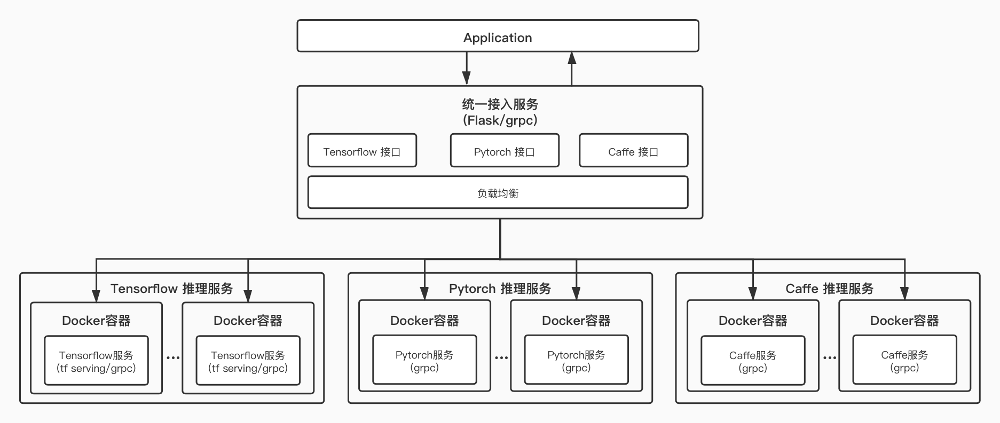

<!--
 * @Author: mukangt
 * @Date: 2020-12-15 14:54:39
 * @LastEditors: mukangt
 * @LastEditTime: 2020-12-15 15:37:42
 * @Description: 
-->
### 代码目录
```
.
├── lb_serving
│   ├── app
│   ├── conf
│   ├── Dockerfile
│   ├── grpc_client.py
│   ├── grpc_server.py
│   ├── locust_file.py
│   ├── logs
│   ├── README.md
│   ├── run.sh
│   └── test.jpg
├── model_serving
│   ├── app
│   ├── conf
│   ├── Dockerfile
│   ├── logs
│   ├── README.md
│   ├── run_client.py
│   ├── run_server.py
│   ├── run.sh
│   └── test.jpg
├── README.md
└── FRServing.jpg
```
